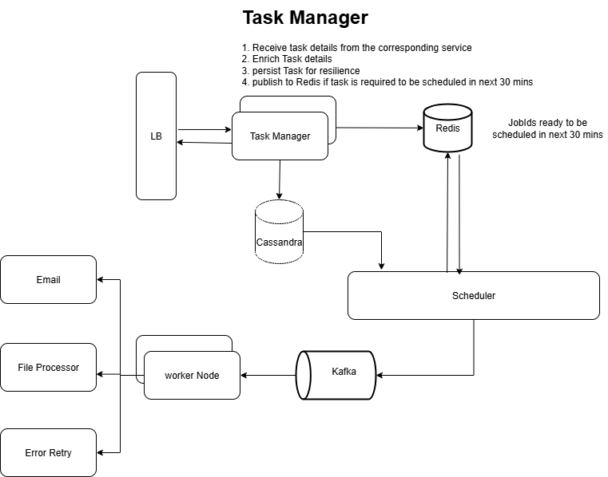

# Distributed Job Scheduler

A highly available, fault-tolerant distributed job scheduler built using **Spring Boot**, **Kafka**, and **Cassandra**.  
The system is designed to reliably schedule, execute, and track jobs with strong guarantees on retry handling, fault recovery, and deduplication.

---

## 📌 High-Level Architecture

**Components:**

1. **API Service**
   - Exposes REST APIs to create, update, cancel, or query jobs.
   - Writes job metadata into **Cassandra**.
   - Publishes scheduling requests to **Kafka**.

2. **Scheduler Service**
   - Reads scheduling requests from Kafka.
   - Persists jobs into Cassandra (if not already present).
   - Continuously scans Cassandra for jobs that are due for execution.
   - Dispatches jobs to Kafka `workerTopic`.

3. **Worker Nodes**
   - Consume jobs from Kafka `workerTopic`.
   - Execute the business logic associated with the job.
   - Push job status (success/failure) back to Kafka `statusTopic`.

4. **Result Processor**
   - Consumes results from `statusTopic`.
   - Updates Cassandra with final job status, retries, or error details.

---

## 📌 Data Modeling in Cassandra

Cassandra schema is designed for **fast access and cancellation**:

- **Table: `jobs`**
  - `jobId` (UUID, Partition Key)
  - `scheduleTimeJobs` (Clustering Key)
  - `status` (Scheduled, Running, Completed, Failed, Cancelled)
  - `payload` (Job metadata, execution params)
  - `retryCount`

👉 This schema ensures:
- Quick lookup by `jobId` for **cancellation/updates**.
- Range queries on `scheduleTimeJobs` for **finding due jobs efficiently**.

---

## 📌 Kafka Usage

- **Topic: `scheduleTopic`**
  - Partition key: `jobId` (ensures all updates for a job go to the same partition).
  - Used to broadcast new jobs to schedulers.

- **Topic: `workerTopic`**
  - Partition key: `jobId`.
  - Ensures **job execution happens on one worker only**.

- **Topic: `statusTopic`**
  - Used by workers to send success/failure updates.
  - Consumed by result processors to update Cassandra.

---

## 📌 Job Lifecycle

1. API Service receives job → stores in Cassandra → produces event to `scheduleTopic`.
2. Scheduler picks it up → checks due time.
   - If not due → waits.
   - If due → pushes to `workerTopic`.
3. Worker consumes → executes → produces result to `statusTopic`.
4. Result Processor updates Cassandra.

---

## 📌 Handling Failures

- **Scheduler Crash:**  
  Since jobs are persisted in Cassandra, another scheduler can resume scanning for due jobs. No jobs are lost.

- **Worker Crash (Mid-Execution):**  
  Kafka re-delivers the job (at-least-once semantics). Deduplication logic ensures idempotency.

- **Result Processor Crash:**  
  Kafka ensures results remain until processed. On restart, the processor resumes.

---

## 📌 Retry & Delayed Execution

- Failed jobs are **re-sent to a delayed retry queue**.
- Kafka does not natively support delayed queues, so we implement retries via **Cassandra + scheduler**:
  - On failure, job is reinserted into Cassandra with new `scheduleTimeJobs` (now + backoff delay).
  - Scheduler will pick it up again when due.

- Backoff Strategy:  
  - **Exponential backoff** or **fixed delay** configurable per job.
  - Max retries enforced via `retryCount`.

---

## 📌 Delivery Semantics

- **At-Least-Once:**  
  Guaranteed via Kafka re-delivery + Cassandra persistence.  
  Duplicate executions possible → jobs must be **idempotent**.

- **Exactly-Once (Best Effort):**
  - Use Cassandra’s `IF NOT EXISTS` writes for execution markers.
  - Job execution writes an **“execution token”** in Cassandra before running.
  - If token exists, worker skips execution.
  - This ensures a job is executed only once even if re-delivered.

---

## 📌 Deduplication

- **Keyed by `jobId`**
- Cassandra write with `IF NOT EXISTS` ensures duplicate jobs are ignored.
- Worker ensures **idempotency** by checking the execution marker before running.

---

## 📌 Scalability

- Cassandra cluster scales horizontally → handles large job storage.
- Kafka partitions scale consumers across schedulers and workers.
- Worker pool is auto-scalable (Kubernetes / ECS / VM-based).

---

## 📌 Monitoring & Observability

- **Metrics Tracked:**
  - Number of scheduled jobs.
  - Number of executed jobs.
  - Failure vs success ratio.
  - Retry counts.
- **Tools:** Prometheus + Grafana.

---

## 📌 Future Improvements

- **Priority Queues:** Support high-priority jobs using separate topics.
- **Cron Jobs:** Add recurring schedule support.
- **Dead-Letter Queue (DLQ):** For jobs failing after max retries.
- **Dynamic Backoff Policies:** Per-job configurable retry logic.
- **Audit Log:** Maintain append-only audit trail in Cassandra.

---

## ✅ Guarantees

- **High Availability:** No single point of failure. Cassandra + Kafka ensure persistence and recovery.
- **Fault Tolerance:** Failures handled via retries and deduplication.
- **Scalability:** Horizontal scaling of workers, schedulers, and Cassandra.
- **Consistency:** Cassandra + Kafka together ensure strong eventual consistency.

---
