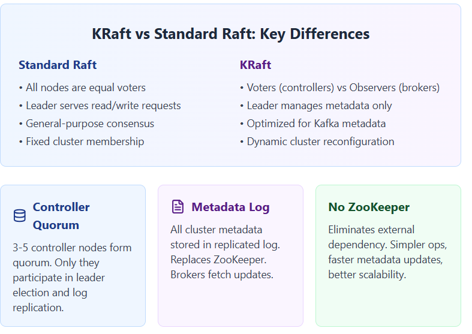

# ⚖️ Standard Raft vs. KRaft (Kafka Raft): Key Differences

The **RAFT (Reliable, Available, Fault-tolerant) Consensus Algorithm** is a foundational protocol for achieving consistency in distributed systems. **KRaft** is an evolution of Raft specifically tailored for Apache Kafka's metadata management, replacing the traditional ZooKeeper dependency.

This document outlines the key differences between the two algorithms and highlights the architectural changes introduced by KRaft.

---

## 🖼️ Comparison Summary

The image below summarizes the key architectural and functional distinctions between Standard Raft and the Kafka-optimized KRaft.

---

## 🔑 KRaft Architectural Innovations

KRaft introduced several fundamental changes to Kafka's cluster topology and consensus mechanism, distinguishing it from general-purpose Raft implementations:

### 1. Differentiated Node Roles

Unlike Standard Raft where all nodes are equal participants (voters), KRaft separates roles:

| Role | Standard Raft | KRaft (Kafka Raft) |
| :--- | :--- | :--- |
| **Voter Nodes** | **All** nodes participate in leader election and log replication. | **Controller Quorum** (3-5 specialized nodes) are the only voters. |
| **Observer Nodes** | N/A | **Regular Brokers** fetch metadata updates but do not vote in elections. |
| **Leader Role** | Serves general **read/write requests** (application data). | **Active Controller** manages **metadata only** (topics, partitions, etc.). |

### 2. Metadata Handling

KRaft centralizes and streamlines metadata management:

| KRaft Feature | Description |
| :--- | :--- |
| **Metadata Log** | All cluster metadata (which includes partition assignments, configuration, etc.) is stored in a replicated log managed by the Controller Quorum. |
| **No ZooKeeper** | Eliminates the external dependency on ZooKeeper. This leads to **simpler operations**, **faster metadata updates**, and **better scalability** for large clusters. |

### 3. Cluster Flexibility

KRaft is designed to handle the dynamic nature of Kafka clusters:

* **Dynamic Cluster Reconfiguration:** KRaft supports changing the set of controller nodes (voters) while the cluster is running, a vital feature for maintenance and scaling that is often complex or restricted in generic Raft implementations.
* **Optimized for Kafka Metadata:** The protocol is specifically optimized for the low-latency, high-throughput replication of small metadata entries, rather than large application data payloads.

---

## 🌟 Conclusion

KRaft leverages the simplicity and durability of the Raft protocol while adapting it to the specialized needs of Kafka's distributed environment. The separation of voter and observer roles, combined with the elimination of ZooKeeper, results in a more efficient, scalable, and operationally simpler system.